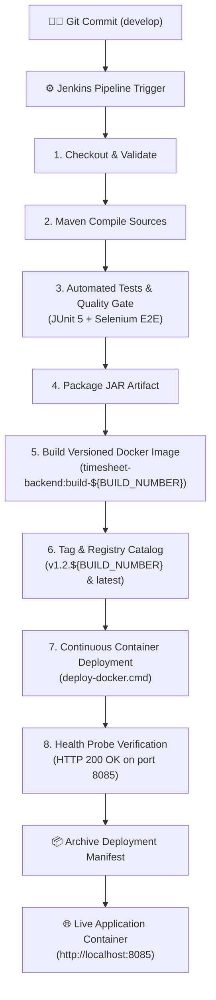

# 🚀 Jenkins-Docker Continuous Deployment Guide (Week 12)

**Project**: Automated Timesheet Management Platform  
**DevOps Phase**: Continuous Deployment (CD) with Docker & Jenkins  
**Student**: Aditya Chavan (Roll No: 23102B0006)  
**Jenkins URL**: `http://localhost:9090`  
**Docker Live Endpoint**: `http://localhost:8085/api/timesheets`  
**Frontend Application**: `http://localhost:8443`  
**Pipeline Definition**: [`Jenkinsfile`](file:///c:/Coding/CLG/dev/Jenkinsfile)

---

## 📌 1. Overview & Objectives

In **Week 12**, we establish true **Continuous Deployment (CD)** by linking our **Jenkins Declarative Pipeline** directly to the **Docker Container Engine**. 

Whenever code is tested and validated:
1. Jenkins automatically builds an immutable, **versioned Docker container image** tagged with the unique Jenkins build number (`build-${BUILD_NUMBER}`).
2. The image is cataloged with release tags (`v1.2.${BUILD_NUMBER}` and `latest`).
3. Jenkins executes [`timesheet-management/deploy/deploy-docker.cmd`](file:///c:/Coding/CLG/dev/timesheet-management/deploy/deploy-docker.cmd) to stop any outdated container, instantiate the new container with live MySQL database bindings, probe the `/api/timesheets` health endpoint until HTTP 200 is confirmed, and archive a cryptographically audited deployment manifest.

---

## 🏗️ 2. End-to-End CD Architecture



---

## ⚙️ 3. Pipeline Parameters

The pipeline supports both native artifact deployments and Docker containerized deployments through declarative parameters:

| Parameter | Type | Default | Description |
| :--- | :---: | :---: | :--- |
| `ENVIRONMENT` | Choice | `dev` | Target environment (`dev`, `staging`, `production`) |
| `SERVER_PORT` | String | `8080` | Native host port for JAR deployment |
| `RUN_TESTS` | Boolean | `true` | Executes automated tests before packaging (Quality Gate) |
| `AUTO_DEPLOY` | Boolean | `true` | Deploys native JAR artifact to `deploy/current` |
| **`DOCKER_DEPLOY`** | **Boolean** | **`true`** | **Builds versioned Docker image and redeploys container** |
| **`DOCKER_PORT`** | **String** | **`8085`** | **Exposed host port mapped to container port 8080** |

---

## 🐳 4. Versioned Image & Tagging Strategy

Every successful Jenkins run tags images using a strict versioning convention:

1. **Build Tag (`timesheet-backend:build-${BUILD_NUMBER}`)**:
   Directly traces the running container back to the exact Jenkins build log, Git commit SHA, and test report.
2. **Release Semantic Tag (`timesheet-backend:v1.2.${BUILD_NUMBER}`)**:
   Production-ready version tag for release tracking.
3. **Rolling Tag (`timesheet-backend:latest`)**:
   Always points to the most recently built and verified stable image.

### Image Verification Command
```powershell
docker images timesheet-backend
```

---

## 🔄 5. Automated Container Deployment Workflow

The automated deployment script [`timesheet-management/deploy/deploy-docker.cmd`](file:///c:/Coding/CLG/dev/timesheet-management/deploy/deploy-docker.cmd) performs 5 automated steps:

1. **Engine Validation**: Confirms Docker daemon is online and responsive.
2. **Graceful Teardown**: Stops and removes any previously running `timesheet-app` container without affecting persistent MySQL state.
3. **Container Launch**: Spins up the fresh versioned image with host network routing (`host.docker.internal:host-gateway`) and environment credentials for MySQL.
4. **Readiness Probe**: Iteratively tests `http://localhost:8085/api/timesheets` every 2 seconds (up to 20 attempts) until HTTP 200 is received.
5. **Manifest Generation**: Generates `timesheet-management/deploy/current/deployment-manifest-docker.json` containing container ID, image digest, timestamp, and health status.

### Sample Deployment Manifest (`deployment-manifest-docker.json`)

```json
{
  "application": "timesheet-backend",
  "deploymentType": "Docker Container",
  "image": "timesheet-backend:build-6",
  "imageDigest": "sha256:443a5a13306e810a9526ffa71b019bb2e8b50d056468b15493b424f4fbfaf2e9",
  "containerName": "timesheet-app",
  "containerId": "c80f23ac9d46dfd96c4940b0b2a920730691592d79fb023ca97514fc6afc7a89",
  "hostPort": "8085",
  "containerPort": "8080",
  "buildNumber": "6",
  "healthStatus": "200",
  "deployedAt": "01/10/2026 18:02:39.45",
  "status": "DEPLOYED_AND_VERIFIED"
}
```

---

## ⏪ 6. Rollback & Disaster Recovery Strategy

Because each build produces an immutable, versioned image (`timesheet-backend:build-${BUILD_NUMBER}`), rolling back to any previous stable build takes a single command:

```powershell
# Rollback to Build #5 in 5 seconds:
docker rm -f timesheet-app
docker run -d --name timesheet-app -p 8085:8080 `
  --add-host=host.docker.internal:host-gateway `
  -e SPRING_DATASOURCE_URL="jdbc:mysql://host.docker.internal:3306/timesheet_db?createDatabaseIfNotExist=true&useSSL=false&allowPublicKeyRetrieval=true&serverTimezone=UTC" `
  -e SPRING_DATASOURCE_USERNAME=root `
  -e SPRING_DATASOURCE_PASSWORD=root `
  timesheet-backend:build-5
```

---

## 📋 7. Running the Pipeline in Jenkins

1. Open **[http://localhost:9090](http://localhost:9090)** in your browser.
2. Navigate to **`timesheet-pipeline`**.
3. Click **Build with Parameters** (or **Build Now**).
4. Verify parameters:
   - `ENVIRONMENT`: `dev`
   - `RUN_TESTS`: `true`
   - `AUTO_DEPLOY`: `true`
   - `DOCKER_DEPLOY`: `true`
   - `DOCKER_PORT`: `8085`
5. Click **Build**.
6. Observe all stages turning green:
   `Checkout & Validate` ➔ `Build` ➔ `Automated Tests` ➔ `Package` ➔ `Build Docker Image` ➔ `Tag & Registry Catalog` ➔ `Deploy Docker Container` ➔ `Container Health Verification`.
7. Once finished, visit **[http://localhost:8443](http://localhost:8443)** or **[http://localhost:8085/api/timesheets](http://localhost:8085/api/timesheets)** to see the live application in action!
