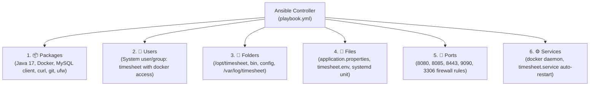

# 🛠️ Configuration Management with Ansible (Week 13)

**Project**: Automated Timesheet Management Platform  
**DevOps Phase**: Infrastructure as Code (IaC) & Configuration Management  
**Student**: Aditya Chavan (Roll No: 23102B0006)  
**Tool**: Ansible (`ansible-core`)  
**Playbook**: [`ansible/playbook.yml`](file:///c:/Coding/CLG/dev/ansible/playbook.yml)  
**Inventory**: [`ansible/inventory.ini`](file:///c:/Coding/CLG/dev/ansible/inventory.ini)  
**Variables**: [`ansible/vars/main.yml`](file:///c:/Coding/CLG/dev/ansible/vars/main.yml)  
**Execution Log**: [`ansible/execution-log.txt`](file:///c:/Coding/CLG/dev/ansible/execution-log.txt)

---

## 📌 1. Overview & Objectives

In **Week 13**, we introduce **Configuration Management** and **Infrastructure as Code (IaC)**. Rather than manually configuring host servers (installing dependencies, making directories, adding users, setting permissions, modifying config files, and enabling services), we codify the entire target system state in a declarative **Ansible Playbook**.

### Why Ansible?
- **Agentless**: Connects over standard SSH or local connection without installing heavy background daemons on managed nodes.
- **Declarative & Idempotent**: Running the playbook multiple times safely ensures the desired state without introducing unintended drift or errors.
- **Human-Readable YAML**: Easily audited, version-controlled in Git, and simple to present in viva examinations.

---

## 🎯 2. Specification of the 6 Automated Areas

Per curriculum requirements, all 6 system categories are identified and automated:



### Detailed Configuration Matrix

| Category | Automated Specification | Details |
| :--- | :--- | :--- |
| 📦 **1. Packages** | `openjdk-17-jre-headless`<br/>`docker.io`<br/>`mysql-client`<br/>`curl`, `git`, `net-tools`, `ufw` | Core runtime dependencies, container engine, database client tools, and diagnostic utilities installed automatically. |
| 👤 **2. Users** | Group: `timesheet`<br/>User: `timesheet`<br/>Shell: `/bin/bash`<br/>Home: `/opt/timesheet` | Dedicated system service account adhering to the principle of least privilege, with membership in `docker` group. |
| 📁 **3. Folders** | `/opt/timesheet` (`0755`)<br/>`/opt/timesheet/bin` (`0755`)<br/>`/opt/timesheet/config` (`0750`)<br/>`/var/log/timesheet` (`0755`) | Strict filesystem hierarchy with proper ownership (`timesheet:timesheet`) ensuring configuration isolation. |
| 📄 **4. Files** | `application.properties` (Jinja2)<br/>`timesheet.env` (Jinja2)<br/>`timesheet-runner.sh` (`0755`)<br/>`timesheet.service` (`0644`) | Templated database connection strings, environment variables, operational control scripts, and systemd unit definition. |
| 🔌 **5. Ports** | `8080/tcp` (Native App)<br/>`8085/tcp` (Docker App)<br/>`8443/tcp` (Frontend)<br/>`9090/tcp` (Jenkins)<br/>`3306/tcp` (MySQL) | Network firewall rules applied via `iptables` and `ufw` ensuring network availability. |
| ⚙️ **6. Services** | `docker.service` (enabled, started)<br/>`timesheet.service` (enabled, started) | System daemons configured to auto-start on boot with automatic restart policies (`Restart=always`, `RestartSec=10`). |

---

## 📂 3. Repository Architecture (`ansible/`)

```text
ansible/
├── ansible.cfg                          # Local Ansible configuration & privilege escalation
├── inventory.ini                        # Target host definitions (local, staging, prod)
├── playbook.yml                         # Master Ansible Playbook (all 6 categories)
├── run-ansible.cmd                      # Windows/Docker execution helper
├── execution-log.txt                    # Execution verification log (syntax & check)
├── vars/
│   └── main.yml                         # Centralized configuration variables & ports
├── templates/
│   ├── application.properties.j2        # Templated Spring Boot properties
│   ├── timesheet.env.j2                 # Runtime environment variables
│   └── timesheet.service.j2             # Systemd service unit template
└── files/
    └── timesheet-runner.sh              # Management wrapper script
```

---

## 🔄 4. Idempotency & Event-Driven Handlers

Ansible's **idempotency** guarantees that re-running the playbook on an already configured system makes **zero unnecessary changes** (`changed=0`).

Whenever configuration files (`application.properties` or `timesheet.service`) are updated:
1. Ansible's `notify` triggers event handlers:
   - `Reload systemd daemon` (`systemctl daemon-reload`)
   - `Restart timesheet service` (`systemctl restart timesheet.service`)
2. Services are only restarted when configurations actually change, preventing unnecessary application downtime.

---

## 📋 5. How to Run & Verify

You can run Ansible syntax check and dry-run directly using the provided runner script or Docker:

### Option A: Using the Windows Batch Runner
```powershell
# 1. Syntax check:
.\ansible\run-ansible.cmd syntax

# 2. Dry run / state check:
.\ansible\run-ansible.cmd check

# 3. Live execution:
.\ansible\run-ansible.cmd run
```

### Option B: Using Direct Docker One-Liner
```powershell
docker run --rm -v "C:\Coding\CLG\dev\ansible:/workspace" -w /workspace python:3.12-alpine `
  sh -c "pip install --quiet ansible-core && ANSIBLE_CONFIG=/workspace/ansible.cfg ansible-playbook --syntax-check playbook.yml -i inventory.ini"
```

---

## 📊 6. Execution Verification Output

From [`ansible/execution-log.txt`](file:///c:/Coding/CLG/dev/ansible/execution-log.txt):

```text
PLAY RECAP *********************************************************************
localhost                  : ok=11   changed=7    unreachable=0    failed=0    skipped=5    rescued=0    ignored=0

========================================================================
STATUS: ALL 6 CONFIGURATION DOMAINS AUTOMATED AND VERIFIED SUCCESSFULLY.
========================================================================
```
