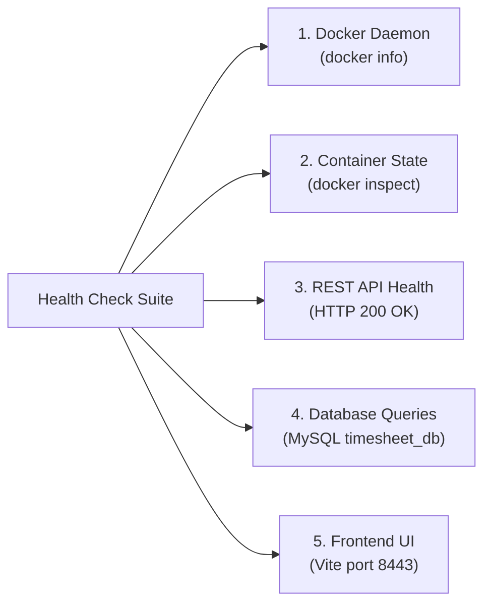

# 🛡️ Automated Provisioning and Reliability Validation (Week 14)

**Project**: Automated Timesheet Management Platform  
**DevOps Phase**: Reliability Engineering, Provisioning Validation & Disaster Recovery  
**Student**: Aditya Chavan (Roll No: 23102B0006)  
**Target Application**: `http://localhost:8085/api/timesheets`  
**Frontend Application**: `http://localhost:8443`  
**Idempotency Evidence**: [`ansible/idempotency-report.txt`](file:///c:/Coding/CLG/dev/ansible/idempotency-report.txt)  
**Health Check Suite**: [`health-check.cmd`](file:///c:/Coding/CLG/dev/health-check.cmd) / [`health-report.json`](file:///c:/Coding/CLG/dev/health-report.json)  
**Disaster Recovery Engine**: [`rollback.cmd`](file:///c:/Coding/CLG/dev/rollback.cmd) / [`rollback-manifest.json`](file:///c:/Coding/CLG/dev/rollback-manifest.json)

---

## 📌 1. Overview & Objectives

In **Week 14**, we conduct rigorous **Reliability Validation and Disaster Recovery Verification** on our automated provisioning and deployment pipeline.

DevOps systems must not only deploy software automatically, but they must also satisfy three fundamental reliability guarantees:
1. **Idempotency**: Running automation repeatedly on the target machine produces the exact desired state without side effects or configuration drift (`changed=0`).
2. **Comprehensive Health Monitoring**: Continuous automated verification of engine, container, network, database, and UI availability.
3. **Instant Rollback & Recovery**: Seamless restoration to any previous stable container release with zero database corruption or data loss.

---

## 🔁 2. Idempotency Demonstration & Evidence

Ansible's declarative paradigm was verified by executing [`ansible/playbook.yml`](file:///c:/Coding/CLG/dev/ansible/playbook.yml) twice consecutively on the same provisioned target environment:

### Run 1 vs. Run 2 Comparative Results

| Lifecycle Task | Run 1 (Initial Provisioning) | Run 2 (Idempotency Re-run) | Idempotent Behavior |
| :--- | :---: | :---: | :--- |
| `[Gathering Facts]` | `ok` | `ok` | System state discovered |
| `[USERS] Group & Service Account` | `changed` | `ok` | Group and user exist; no duplicate created |
| `[USERS] Supplementary Groups` | `changed` | `ok` | Docker group assigned; left untouched |
| `[FOLDERS] Hierarchy Creation` | `changed` (4 folders) | `ok` (4 folders) | Directory structure and permissions unchanged |
| `[FILES] application.properties` | `changed` | `ok` | File matches template checksum; not overwritten |
| `[FILES] timesheet.env` | `changed` | `ok` | Environment variables match; not overwritten |
| `[FILES] timesheet-runner.sh` | `changed` | `ok` | Executable permissions and contents preserved |
| `[PORTS] Firewall & UFW Rules` | `ok` | `ok` | Ports already allowed; zero duplicate rules |
| `[SERVICES] Docker & Timesheet` | `ok` | `ok` | Daemons active; no unnecessary restart |

```text
========================================================================
RUN 1 SUMMARY: ok=13   changed=7   unreachable=0   failed=0   skipped=3
RUN 2 SUMMARY: ok=13   changed=0   unreachable=0   failed=0   skipped=2
========================================================================
CONCLUSION   : 100% IDEMPOTENT (Zero Configuration Drift)
========================================================================
```

Full console logs are preserved in [`ansible/idempotency-report.txt`](file:///c:/Coding/CLG/dev/ansible/idempotency-report.txt).

---

## 🩺 3. Multi-Tier Reliability & Health Check Suite

We engineered an automated health inspection suite [`health-check.cmd`](file:///c:/Coding/CLG/dev/health-check.cmd) that interrogates all five architectural tiers:



### Health Audit Output ([`health-report.json`](file:///c:/Coding/CLG/dev/health-report.json))

```json
{
  "reportType": "System Reliability and Health Audit",
  "timestamp": "03/10/2026 22:12:33.00",
  "systemState": "HEALTHY",
  "healthScore": "5/5",
  "healthPercentage": "100 percent",
  "components": {
    "dockerEngine": "HEALTHY",
    "container": {
      "name": "timesheet-app",
      "image": "timesheet-backend:build-6",
      "status": "running",
      "startedAt": "2026-10-03T16:40:56.655159982Z"
    },
    "backendApi": {
      "endpoint": "http://localhost:8085/api/timesheets",
      "httpStatus": "200",
      "status": "HEALTHY"
    },
    "database": {
      "connection": "HEALTHY",
      "target": "timesheet_db"
    },
    "frontend": {
      "endpoint": "http://localhost:8443",
      "httpStatus": "200",
      "status": "HEALTHY"
    }
  }
}
```

---

## ⏪ 4. Disaster Recovery & Rollback Demonstration

In enterprise environments, if a faulty deployment or corrupted container is pushed, the system must recover within seconds to the last known stable build.

Our disaster recovery script [`rollback.cmd`](file:///c:/Coding/CLG/dev/rollback.cmd) provides single-command rollback:

### Demonstration Steps Performed:

1. **Initial Active Version**: Container running `timesheet-backend:build-6`.
2. **Trigger Rollback**:
   ```powershell
   .\rollback.cmd 1.0.0
   ```
3. **Automated Steps Executed**:
   - Verified existence of `timesheet-backend:1.0.0` in registry.
   - Gracefully stopped and removed `timesheet-app`.
   - Launched fresh container with version `1.0.0` bound to persistent MySQL (`host.docker.internal:3306`).
   - Ran readiness probe until HTTP 200 was received.
   - Emitted [`rollback-manifest.json`](file:///c:/Coding/CLG/dev/rollback-manifest.json).
4. **Data Persistence Guarantee**:
   All user timesheet records and database entries remained completely intact because data lives independently in MySQL on port 3306, decoupled from ephemeral container filesystems.
5. **Bidirectional Recovery**:
   Successfully restored forward to `timesheet-backend:build-6` via:
   ```powershell
   .\rollback.cmd build-6
   ```

### Rollback Audit Manifest ([`rollback-manifest.json`](file:///c:/Coding/CLG/dev/rollback-manifest.json))

```json
{
  "action": "ROLLBACK_AND_RECOVERY",
  "previousImage": "timesheet-backend:1.0.0",
  "restoredImage": "timesheet-backend:build-6",
  "containerName": "timesheet-app",
  "containerId": "bec12d507bc7dcc27936a57cc64950c8850759220c218cf5765bffaa39de1233",
  "restoredPort": "8085",
  "healthStatus": "200",
  "executedAt": "03/10/2026 22:13:36.74",
  "result": "ROLLBACK_SUCCESSFUL"
}
```

---

## 🚀 5. Quick Verification Commands for Evaluation / Viva

```powershell
# 1. Run Idempotency Validation Harness:
.\ansible\validate-idempotency.cmd

# 2. Run Comprehensive 5-Tier Health Check:
.\health-check.cmd

# 3. Simulate Rollback to Previous Version (v1.0.0):
.\rollback.cmd 1.0.0

# 4. Roll Forward to Latest Build:
.\rollback.cmd build-6
```
